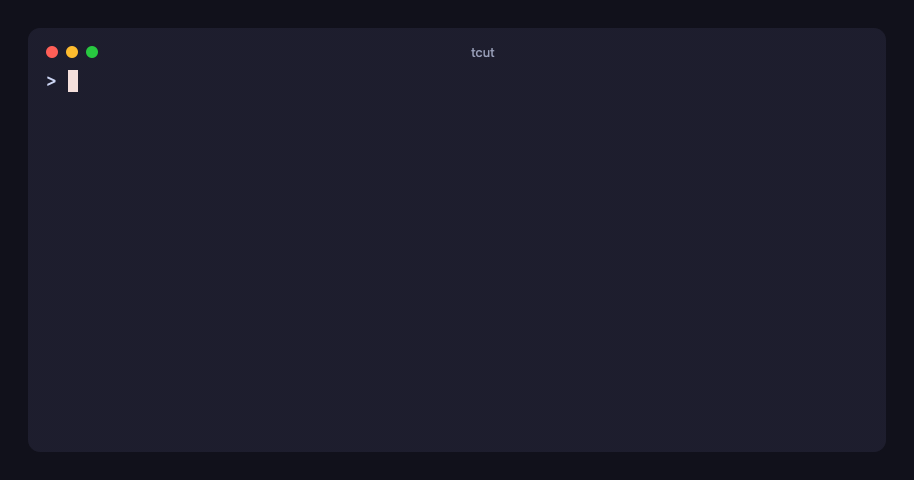

# tcut

Script terminal sessions in **TypeScript**, render them to **reproducible** MP4 / GIF / WebM / SVG / HTML / PNG.

Built on Bun 1.4 — `Bun.Terminal` for the PTY, `Bun.WebView` for pixels, `Bun.build` for the renderer,
`Bun.Image` for stills, `bun build --compile` for a single binary — plus [wterm](https://github.com/vercel-labs/wterm)'s
libghostty WASM core as the terminal emulator. Inspired by [VHS](https://github.com/charmbracelet/vhs); scripts are
code, and recording is separate from rendering.



<sub>Made by tcut from [`examples/readme.ts`](examples/readme.ts). Same cast as SVG: [docs/demo.svg](docs/demo.svg).</sub>

```ts
// demo.video.ts
import { defineVideo } from "tcut";

export default defineVideo(
  {
    output: ["out/demo.mp4", "out/demo.gif", "out/demo.svg"],
    theme: "catppuccin-mocha",
    cols: 80, rows: 20,
    typingSpeed: "40ms", typingJitter: 0.4,      // jitter is seeded → reproducible
    windowBar: "colorful", title: "tcut", margin: 32, borderRadius: 12,
  },
  async (t) => {
    await t.hide(() => t.run("cd /tmp && mkdir -p demo && cd demo"));  // happens, but is cut from the video

    await t.run("echo 'Hello 👋'");       // type + Enter + wait for the prompt to come back
    await t.run("ls -la");
    await t.expect(/total \d+/);          // assertion — the script doubles as an integration test
    await t.screenshot("out/ls.png");
    await t.sleep("1.5s");
  },
);
```

```sh
bun install
bun src/cli.ts demo.video.ts     # or: bun link && tcut demo.video.ts
```

## Why not VHS?

| | VHS | tcut |
|---|---|---|
| Script format | `.tape` DSL | TypeScript: loops, imports, shared scenes, assertions |
| Wait for output | `Wait` regex on raw bytes | `wait()` / `expect()` / `run()` read the **rendered screen** (headless Ghostty) |
| Determinism | live screenshots, machine-speed dependent | record once to `.cast`, render on a virtual clock → identical frames anywhere |
| Re-theme | re-run everything | `tcut render demo.cast --theme dracula` — no shell is spawned |
| Outputs | mp4 / gif / webm / png frames | + **animated SVG**, **single-file HTML player**, PNG/JPG stills — SVG/HTML need no ffmpeg or browser |
| As tests | — | `tcut test` runs scripts in fast mode, exit code reflects `expect()` |
| Stack | ttyd + Chrome + ffmpeg | Bun + wterm (JS/WASM) + ffmpeg (only for video containers) |

## Requirements

- Bun ≥ 1.4
- `ffmpeg` for `.mp4` / `.gif` / `.webm` / `.webp` (SVG, HTML, PNG/JPG and PNG sequences don't need it).
  tcut checks `$TCUT_FFMPEG`, then `ffmpeg` on PATH, then Homebrew's keg-only `ffmpeg-full` — the regular
  Homebrew `ffmpeg` 9.x formula has no libwebp, so for `.webp` run `brew install ffmpeg-full`.
- macOS renders with the system WebKit. Linux/Windows need Chrome or Edge installed for `Bun.WebView`.

## How it works

```
script.ts ─▶ record (Bun.Terminal PTY) ─▶ demo.cast ─▶ render (virtual clock) ─▶ mp4 / gif / webm / png
             clean shell; every chunk      asciicast v2   ├─ Bun.WebView + @wterm/dom → ffmpeg
             also feeds a headless                        ├─ headless grid → animated SVG
             Ghostty core for wait/expect                 └─ cast + lite core → self-contained HTML
```

- **Record** drives a clean shell (no rc files, fixed prompt, `TERM=xterm-256color`) in a PTY. Output is
  timestamped into an asciicast v2 file *and* parsed by a headless Ghostty terminal, so `run()` knows when the
  prompt is back and `expect()` sees what a human would see. Terminal queries (e.g. from vim) are answered.
- **Render** replays the cast: frame *N* is the screen at *N / fps*. Hidden sections are cut, playback speed is
  applied, cursor blink is driven by the render clock. Unchanged frames are reused, so idle time is free.
- **Cache**: re-running an unchanged script reuses the cast (`--force` to re-record). `quantize: true` snaps
  timestamps to the frame grid for byte-stable casts.

## CLI

```
tcut <script.ts> [options]          record + render
tcut record <script.ts>             record only (writes the .cast)
tcut render <file.cast> [options]   render an existing .cast (tcut or asciinema)
tcut test <path...>                 run scripts in fast mode as tests (no video)
tcut init [name] [--template t]     scaffold a script: basic | tour | test
tcut themes                         list built-in themes

-o, --output <path>   .mp4 .webm .gif .webp .svg .html .png .jpg or a directory/ for PNG frames (repeatable)
    --theme <name>    catppuccin-mocha | dracula | github-dark | tokyo-night | one-dark
    --font <family>   --font-size <px>  --line-height <x>  --letter-spacing <px>
    --fps <n>         --speed <x>
    --padding <px>    --margin <px>     --margin-fill <color>  --radius <px>
    --window-bar <none|colorful|colorfulRight|rings|ringsRight>   --title <text>   --no-blink
    --core <ghostty|lite>   --cast <path>   --record-only   --force   -q, --quiet
```

## Script API

`defineVideo(config, async (t) => { … })`

| Config | Default | |
|---|---|---|
| `output` | — | string or string[]; extension selects the format |
| `shell` | `"bash"` | `"bash" \| "zsh" \| "fish" \| "sh"` or a full `string[]` command |
| `prompt` / `promptPattern` | `"> "` | prompt for the clean shell; regex used by `run()` / `wait()` |
| `cols` / `rows` / `fps` | 80 / 24 / 60 | |
| `typingSpeed` / `typingJitter` / `seed` | `"50ms"` / 0 / 1 | |
| `playbackSpeed` | 1 | applied at render time |
| `waitTimeout` / `endPause` | `"15s"` / `"1s"` | |
| `quantize` / `cache` / `core` | false / true / `"ghostty"` | `core: "lite"` = wterm's Zig core (faster, no query replies) |
| `font` | JetBrains Mono 20px, lh 1.2 | `{ family, size, lineHeight, letterSpacing }` |
| `theme` | `"catppuccin-mocha"` | name or a full `Theme` object |
| `cursor` | `{ blink: true, period: 1000 }` | |
| `padding` / `margin` / `marginFill` / `borderRadius` / `windowBar` / `title` | 24 / 0 / bg / 0 / `"none"` / `""` | window chrome |
| `cast` | next to the first output | where the recording is saved |

`t` (a `TerminalSession`):

- Input: `type(text, {speed})`, `run(cmd, {wait, timeout})`, `paste(text)`, `enter() tab() backspace() delete()
  escape() space() up() down() left() right() home() end() pageUp() pageDown()` (repeat count), `ctrl("c")`,
  `alt("b")`, `key("f5")`, `raw(bytes)`
- Timing: `sleep("500ms")`, `wait(/re/, { scope: "line" | "screen", timeout })`
- Assertions: `expect(/re/, { scope })` — throws `ExpectationError` with a screen dump
- Structure: `hide(async () => …)`, `screenshot(path)`, `marker(name)`, `resize(cols, rows)`, `clear()`
- Introspection: `screen()`, `line()`, `cursor()`, `cols`, `rows`, `config`

Durations accept milliseconds or `"500ms" | "1.5s" | "2m"`.

Programmatic use: `const v = defineVideo(...); await v.record(); await v.render(undefined, { overrides: { theme: "dracula" } })`,
`renderCast(file, { output })`, `buildSvg(rec, config)`, `runScriptTests(paths)`.

## Development

```sh
bun test                          # recorder, renderer, exporters, CLI (spawns real shells + WebView)
bun run typecheck
bun src/cli.ts examples/demo.ts
bun run build                     # dist/tcut single binary with embedded renderer assets
```

Specs and tasks are tracked with [OpenSpec](https://github.com/Fission-AI/OpenSpec) under `openspec/`; the roadmap
and measurements are in `PLAN.md`.
