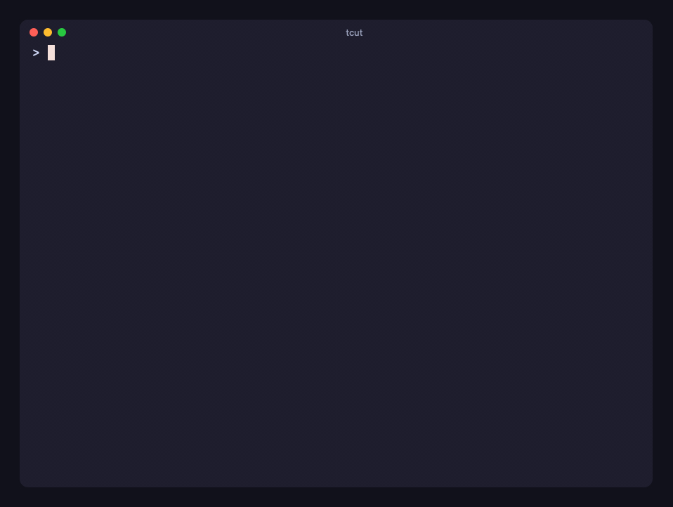

# tcut

[](https://github.com/AmanVarshney01/tcut/actions/workflows/ci.yml)
[](https://www.npmjs.com/package/termcut)
[](LICENSE)

Script terminal sessions in **TypeScript**, render them to **reproducible** MP4 / GIF / WebM / SVG / HTML / PNG — built on Bun.



```sh
bunx termcut init demo     # the npm package is `termcut`, the command is `tcut`
```

**Website:** https://tcut.amanv.dev · **Docs & API:** [`packages/tcut/README.md`](packages/tcut/README.md) · **Binaries:** [Releases](https://github.com/AmanVarshney01/tcut/releases)

## Repository layout

| Path | What |
|---|---|
| [`packages/tcut`](packages/tcut) | the CLI + library, published to npm as [`termcut`](https://www.npmjs.com/package/termcut) |
| [`apps/web`](apps/web) | the website (Astro, static), deployed to Cloudflare Workers with Alchemy |
| [`packages/infra`](packages/infra) | Alchemy stack for the Cloudflare deployment (`bun run deploy:prod`) |
| [`packages/config`](packages/config) | shared TypeScript config |
| [`openspec`](openspec) | specs and change history ([OpenSpec](https://github.com/Fission-AI/OpenSpec)) |
| [`PLAN.md`](PLAN.md) | roadmap and the measurements behind the design |

```sh
bun install
bun run typecheck        # turbo: all packages
bun run test             # turbo: tcut tests (spawn real shells + WebView; macOS)
bun run build            # turbo: tcut assets/binary + website
bun run demo             # record + render packages/tcut/examples/demo.ts
bun run media            # regenerate the website's demo media with tcut itself
bun run dev:web          # website dev server
bun run deploy:prod      # deploy the website to Cloudflare (Alchemy; `bun run deploy` for a personal stage)
```

Releasing: bump `version` in `packages/tcut/package.json`, commit, `git tag vX.Y.Z && git push --tags`.
